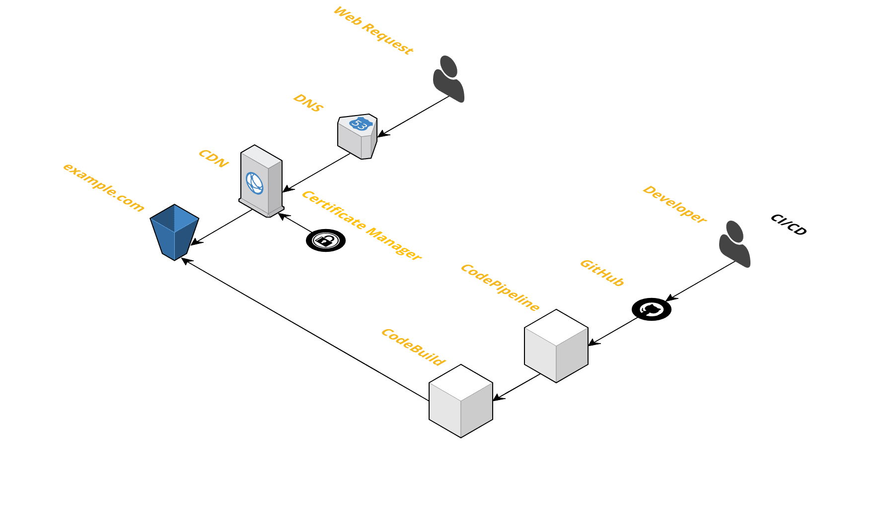

# Static S3 website with SSL and CDN
This template will create the following static website:
- S3 bucket to store and serve static website
- CloudFront to cache and serve website over SSL and using your custom domain
- Certificate Manager to provide the SSL cert
- Route53 to perform the DNS routing

# Setup
## Prerequisites 
- Register your domain with Route53
- Or point your existing domain to Route53
- Configure 'admin@yourdomain.com' to receive the SSL verification email
  - You will have to confirm this email address.  This is annoying and I've asked AWS to remove this step if the domain is used with Route53.
  
## Stack Up
- Replace 'example.com' in _cim.yml with your domain name.
- Run `cim stack-up`

## CI/CD
CI/CD is available.  When enabled all commits to GitHub will trigger CodePipeline to build, test, and deploy your site.

## dev stage
You can also deploy a dev environment for testing.

`cim stack-up --stage=dev`
